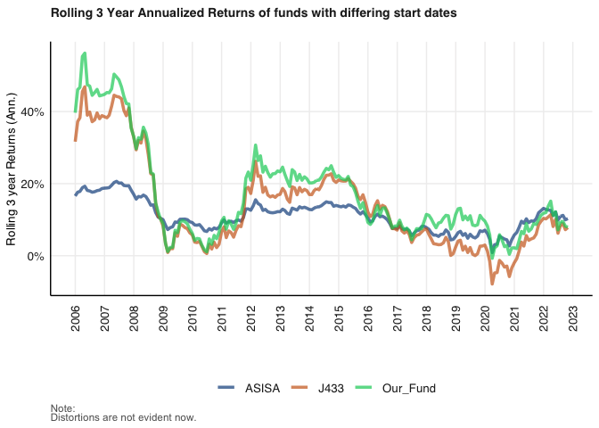
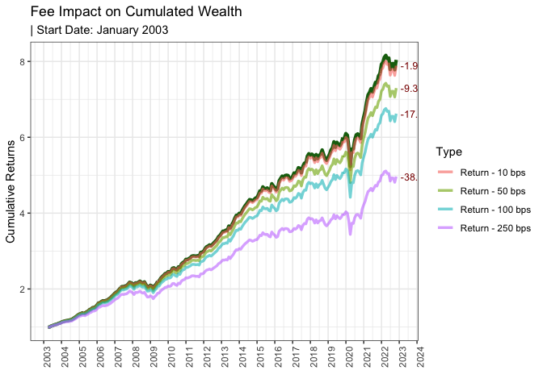
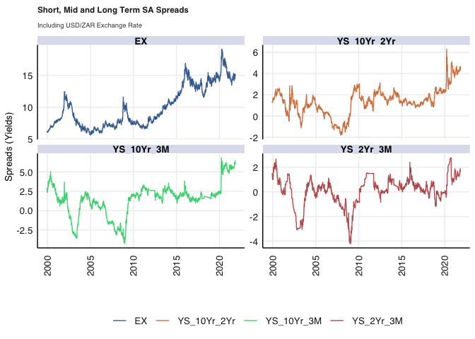
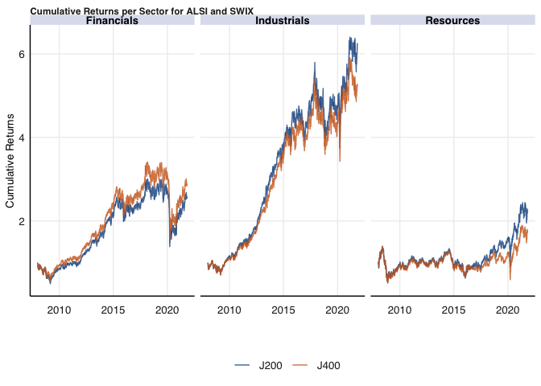
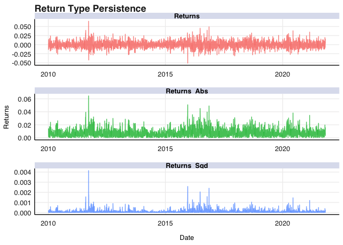
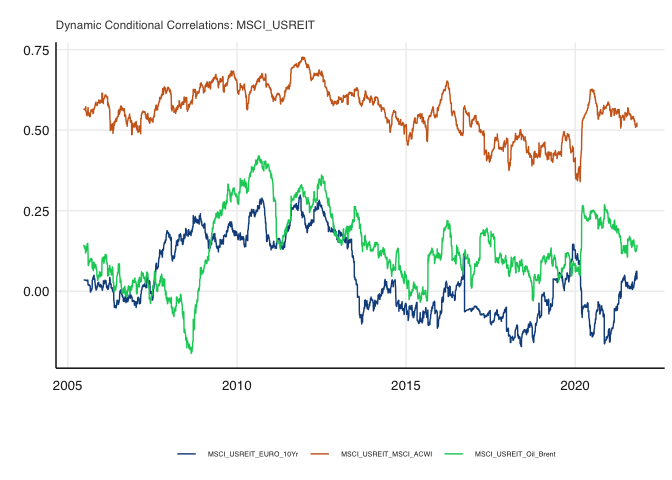
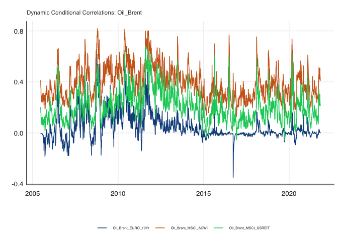

# Purpose

This is the README for the Financial Econometrics Practical Exam. This
folder was created using by running:

``` r
fmxdat::make_project(Mac = TRUE)
```

With the folder structure for all of the questions made with the
following code: \* Noting the difference between creating an html output
and a pdf output

``` r
CHOSEN_LOCATION <- "/Users/svenwellmann/Desktop/Masters Semester 2/Financial Econometrics/Exam/"

Texevier::create_template_html(directory = glue::glue("{CHOSEN_LOCATION}20850980/Questions/"), template_name = "Question1")

Texevier::create_template(directory = glue::glue("{CHOSEN_LOCATION}20850980/Questions/"), template_name = "Question2")

Texevier::create_template(directory = glue::glue("{CHOSEN_LOCATION}20850980/Questions/"), template_name = "Question3")

Texevier::create_template_html(directory = glue::glue("{CHOSEN_LOCATION}20850980/Questions/"), template_name = "Question4")

Texevier::create_template_html(directory = glue::glue("{CHOSEN_LOCATION}20850980/Questions/"), template_name = "Question5")

Texevier::create_template(directory = glue::glue("{CHOSEN_LOCATION}20850980/Questions/"), template_name = "Question6")

Texevier::create_template_html(directory = glue::glue("{CHOSEN_LOCATION}20850980/Questions/"), template_name = "Question7")
```

Cleaning the environment, loading packages and sourcing all functions:

``` r
rm(list = ls()) # Clean your environment:
gc() # garbage collection 
```

    ##          used (Mb) gc trigger (Mb) limit (Mb) max used (Mb)
    ## Ncells 482960 25.8    1046435 55.9         NA   666900 35.7
    ## Vcells 905306  7.0    8388608 64.0      16384  1824543 14.0

``` r
pacman::p_load("xts", "tidyverse", "tbl2xts", "PerformanceAnalytics", "lubridate", "glue", "rmsfuns", "fmxdat", "tidyr", "devtools", "readr", "TTR",
               "DEoptimR", "robustbase", "rportfolios", "RiskPortfolios", "fitHeavyTail", "quadprog", "cowplot", "FactoMineR", "factoextra", "ggdendro", 
               "kableExtra", "MTS")
list.files('code/', full.names = T, recursive = T) %>% .[grepl('.R', .)] %>% as.list() %>% walk(~source(.))
```

# Question 1

## Fund Performance

Load in the data:

``` r
loc1 <- "Questions/Question1/data/"

ASISA <- read_rds(glue::glue("{loc1}ASISA.rds"))
BM <- read_rds(glue::glue("{loc1}Capped_SWIX.rds"))
AI_Fund <- read_rds(glue::glue("{loc1}AI_Max_Fund.rds"))

list.files('code/', full.names = T, recursive = T) %>% as.list() %>% walk(~source(.))
list.files('Questions/Question3/code/', full.names = T, recursive = T) %>% as.list() %>% walk(~source(.))
```

Upun inspection the ASISA has NA values. The best approach to deal with
these is to impute them with the function created by Nico used in
question 3.

``` r
ASISA_wide <- spread(ASISA, key = Name, value = Returns)

ASISA_full <- impute_missing_returns(ASISA_wide, impute_returns_method = "Drawn_Distribution_Collective")
```

Create an average of the ASISA funds as an average for the active funds
in the market for comparison.

``` r
ASISA_ave <- ASISA_full %>% gather(Fund, Return, -date) %>% 
    arrange(date) %>%
    group_by(date) %>%
    mutate(ASISA = mean(Return)) %>% # Name ave returns Asisa for left_join
    select(date, ASISA) %>% 
    unique()
```

Join the data together to make a large dataset and find the first start
date.

``` r
funds <- rbind(ASISA_ave %>% gather(key = Tickers, value = Returns, -date),
               AI_Fund,
               BM) %>% arrange(date)

fund_start_Date <- funds %>% 
    group_by(Tickers) %>% 
    summarise(date = dplyr::first(date)) %>% 
    pull(date) %>% 
    max

funds <- funds %>% filter(date >= fund_start_Date)
```

## Annualised returns

Using a function adapted from class the graph below is created to show
annualised returns for the Benchmark, the average ASISA and our AI fund.

``` r
#======================
# PerformanceAnalytics
#======================

idxxts <- tbl_xts(funds, cols_to_xts = Returns, spread_by = Tickers)

dfplotxts <- 
    bind_rows(
      # Don't annualize for less than a year, e.g.:
      idxxts %>% tail(12) %>% PerformanceAnalytics::Return.annualized(., scale = 12) %>% data.frame() %>% mutate(Freq = "A"),
      
      idxxts %>% tail(36) %>% PerformanceAnalytics::Return.annualized(., scale = 12) %>% data.frame() %>% mutate(Freq = "B"),
      
      idxxts %>% tail(60) %>% PerformanceAnalytics::Return.annualized(., scale = 12) %>% data.frame() %>% mutate(Freq = "C"),
      
      idxxts %>% tail(120) %>% PerformanceAnalytics::Return.annualized(., scale = 12) %>% data.frame() %>% mutate(Freq = "D"),
      
    ) %>% data.frame() %>% gather(Tickers, mu, -Freq) %>% 
  mutate(Tickers = gsub("\\.", " ", Tickers))

# Barplot_foo:
to_string <- as_labeller(c(`A` = "1 Year", `B` = "3 Years", `C` = "5 Years", `D` = "10 Years"))

  g <- 
    
  dfplotxts %>%
  
  # Compare to (they are the exact same):
  # dfplotxts %>%
    
  ggplot() + 
    
  geom_bar( aes(Tickers, mu, fill = Tickers), stat="identity") + 
    
  facet_wrap(~Freq, labeller = to_string, nrow = 1) + 
    
  labs(x = "", y = "Returns (Ann.)" , caption = "Note:\nReturns in excess of a year are in annualized terms.") + 
    
  fmx_fills() + 
    
  geom_label(aes(Tickers, mu, label = paste0( round(mu, 4)*100, "%" )), size = ggpts(8), alpha = 0.35, fontface = "bold", nudge_y = 0.002) + 
    
  theme_fmx(CustomCaption = T, title.size = ggpts(43), subtitle.size = ggpts(38), 
                caption.size = ggpts(30), 
            
                axis.size = ggpts(37), 
            
                legend.size = ggpts(35),legend.pos = "top") +

  theme(axis.text.x = element_blank(), axis.title.y = element_text(vjust=2)) + 
    
  theme(strip.text.x = element_text(face = "bold", size = ggpts(35), margin = margin(.1, 0, .1, 0, "cm"))) 
  
g
```


## Violin plot of Return distribution by fund

The violin plot below clearly shops that the AI fund behaves similarly
to the Benchmark fund and quite opposite to the average of the ASISA
funds. Taking the average of the ASISA funds will condense the density
as we can see and thus is a biased view. The Benchmark fund seems to
reach further, both positively and negatively in returns while the
distribution of the returns for the AI fund are less dense while
simultaneously being less sparse. BAsically less crowded.

``` r
funds
```

    ## # A tibble: 714 × 3
    ## # Groups:   date [238]
    ##    date       Tickers    Returns
    ##    <date>     <chr>        <dbl>
    ##  1 2003-01-31 ASISA     0.00631 
    ##  2 2003-01-31 Our_Fund -0.0275  
    ##  3 2003-01-31 J433     -0.0376  
    ##  4 2003-02-28 ASISA    -0.000563
    ##  5 2003-02-28 Our_Fund -0.0427  
    ##  6 2003-02-28 J433     -0.0459  
    ##  7 2003-03-31 ASISA    -0.00786 
    ##  8 2003-03-31 Our_Fund -0.0945  
    ##  9 2003-03-31 J433     -0.0832  
    ## 10 2003-04-30 ASISA     0.00323 
    ## # … with 704 more rows

``` r
gviolion <- funds %>% ggplot() + geom_violin(aes(Tickers, Returns, fill = Tickers), alpha = 0.7) + fmxdat::theme_fmx() + fmxdat::fmx_fills()

fmxdat::finplot(gviolion, y.pct = T, y.pct_acc = 1, x.vert = T)
```


## Rolling returns

Below we create a 3 year rolling annualised return for all the funds.
The AI fund was clearly above the benchmark for a large proportion of
the time, especially between 2018 and 2022.

``` r
plotdf_rollret <- funds %>% group_by(Tickers) %>% 
# Epic sorcery:
mutate(RollRets = RcppRoll::roll_prod(1 + Returns, 36, fill = NA, align = "right")^(12/36) - 1) %>% 
    group_by(date) %>% filter(any(!is.na(RollRets))) %>% 
    ungroup()

g_roll <- plotdf_rollret %>% 
ggplot() + 
geom_line(aes(date, RollRets, color = Tickers), alpha = 0.7, 
    size = 1.25) + 
labs(title = "Rolling 3 Year Annualized Returns of funds with differing start dates", 
    subtitle = "", x = "", y = "Rolling 3 year Returns (Ann.)", 
    caption = "Note:\nDistortions are not evident now.") + theme_fmx(title.size = ggpts(30), 
    subtitle.size = ggpts(5), caption.size = ggpts(25), CustomCaption = T) + 
    
fmx_cols()
```

    ## Warning: Using `size` aesthetic for lines was deprecated in ggplot2 3.4.0.
    ## ℹ Please use `linewidth` instead.

``` r
finplot(g_roll, x.date.dist = "1 year", x.date.type = "%Y", x.vert = T, 
    y.pct = T, y.pct_acc = 1)
```



# Fees

``` r
ASISA_fee <- ASISA_full %>% gather(Fund, Return, -date) %>% 
    arrange(date) %>%
    group_by(date) %>%
    mutate(Returns = mean(Return)) %>% # Name ave returns Asisa for left_join
    select(date, Returns) %>% 
    unique()

feeconverter <- function(x, Ann_Level) (1+x)^(1/Ann_Level)-1

Start = fund_start_Date
Gap = 3 
Lvlset = 5
mnthfwd = 18

df_p <-ASISA_fee %>% filter(date > fund_start_Date) %>%
        mutate('Return - 10 bps' = Returns - feeconverter(10*1e-4, Ann_Level = 12)) %>%
        mutate('Return - 50 bps' = Returns - feeconverter(50*1e-4, Ann_Level = 12)) %>%
        mutate('Return - 100 bps' = Returns - feeconverter(100*1e-4, Ann_Level = 12)) %>%
        mutate('Return - 250 bps' = Returns - feeconverter(250*1e-4, Ann_Level = 12)) %>%
        rename(Gross = Returns) %>%
        gather(Type, Rets, -date, -Gross) %>%
        group_by(Type) %>% filter(date > min(date)) %>%
        mutate(CP = cumprod(1+Rets)) %>%
        mutate(Gross = cumprod(1+Gross))

Ord <- c('Return - 10 bps', 'Return - 50 bps', 'Return - 100 bps', 'Return - 250 bps')

    Txt <-
        df_p %>% filter(date == max(date)) %>%
        mutate(date = date %m+% months(Gap)) %>%
        mutate(Text = paste0(round(CP/Gross-1, 3)*100, "%")) %>%
        # Order:
        mutate(Type = as.factor(Type)) %>%
        mutate(Type = forcats::fct_relevel(Type, Ord))

    Shock350 <-
        df_p %>% filter(date == max(date)) %>%
        mutate(date = date %m+% months(Gap)) %>%
        filter(Type == 'Return - 350 bps') %>% pull(CP)
    Shock250 <-
        df_p %>% filter(date == max(date)) %>%
        mutate(date = date %m+% months(Gap)) %>%
        filter(Type == 'Return - 250 bps') %>% pull(CP)
    Shock25 <-
        df_p %>% filter(date == max(date)) %>%
        mutate(date = date %m+% months(Gap)) %>%
        filter(Type == 'Return - 10 bps') %>% pull(CP)

    Msg <-
        df_p %>% ungroup() %>% filter(date > max(date) %m+% months(mnthfwd)) %>% slice(1) %>%
        mutate(Lvl = Lvlset) %>% mutate(Msg = glue::glue("R1m invested in {format(Start, '%B %Y')}\n* 10bps: R{round(Shock25, 2)}m\n* 250bps: R{round(Shock250, 2)}m\n* 350bps: R{round(Shock350, 2)}m"))

    g <-
        df_p %>%
        mutate(Type = as.factor(Type)) %>%
        mutate(Type = forcats::fct_relevel(Type, Ord)) %>%

        ggplot() +
        geom_line(aes(date, Gross), color = "darkgreen", size = 1.5, alpha = 0.95) +
        geom_line(aes(date, CP, color = Type), size = 1.2, alpha = 0.6) +
        # ggrepel::geom_label_repel(data = Txt, aes(date, CP, label = Text ), hjust = 0, color = "darkred", alpha = 0.25, size = 3) +
        geom_text(data = Txt, aes(date, CP, label = Text ), hjust = 0, color = "darkred", size = 3.3) +
        theme_bw() +
        geom_label(data = Msg, aes(date, Lvl, label = Msg), color = "darkgreen", alpha = 0.8, size = 4) +
        labs(title = "Fee Impact on Cumulated Wealth",
             subtitle = glue::glue("| Start Date: {format(Start, '%B %Y')}"),
             x = "", y = "Cumulative Returns") +

        scale_x_date(labels = scales::date_format("%Y"), date_breaks = "1 year") +
        theme(axis.text.x=element_text(angle = 90, hjust = 1))

    g
```



# Question 2

## Yield Spreads

We must load in the data from the data folder within the question
folder.

``` r
list.files('Question2/code/', full.names = T, recursive = T) %>% as.list() %>% walk(~source(.))
loc2 <- "Questions/Question2/data/"

SA_bonds <- read_rds(glue::glue("{loc2}SA_Bonds.rds"))
BE_Infl <- read_rds(glue::glue("{loc2}BE_Infl.rds")) # 10yr Break even inflation estimate
bonds_2y <- read_rds(glue::glue("{loc2}bonds_2y.rds")) # International 2yr spreads
bonds_10y <- read_rds(glue::glue("{loc2}bonds_10y.rds")) # International 10yr spreads
usdzar <- read_rds(glue::glue("{loc2}usdzar.rds"))
ZA_Infl <- read_rds(glue::glue("{loc2}ZA_Infl.rds"))
IV <- read_rds(glue::glue("{loc2}IV.rds")) # Volatility Index
```

Then with the data we must clean all the data we want to use and
creature new features we can graph. For the SA_Bonds we need to gather
the data into tidy format to make plotting easier. We will also clean
the inflation data and exchange rate data.

``` r
pacman::p_load("tidyverse", "lubridate", "fmxdat")
```

## Historical Bond Yields

This will look at bond returns historically and how they have moved.
This will then be filtered to look at bond yields since 2020 and assess
their movements.

``` r
# Transforming the Bonds data into tidy format for plotting
SA_bonds_clean <- SA_bonds %>%  
    arrange(date) %>% 
    gather(Ticker, Yield, -date)
```

``` r
SA_Bond_All <- SA_bonds_clean %>% 
    ggplot() +
    geom_line(aes(date, Yield, color = Ticker)) +
    fmxdat::theme_fmx(title.size = ggpts(30),
                      subtitle.size = ggpts(28),
                      caption.size = ggpts(25),
                      CustomCaption = T) + 
  fmxdat::fmx_cols() + 
  labs(x = "", 
       y = "Bond Yields", 
       caption = "Note:\nCalculation own",
       title = "Bond Yields in South Africa across the 3 month, 2 year and 10 year maturities") + 
    guides(color = F)
```

    ## Warning: The `<scale>` argument of `guides()` cannot be `FALSE`. Use "none" instead as
    ## of ggplot2 3.3.4.

``` r
fmxdat::finplot(SA_Bond_All, x.vert = T, x.date.type = "%Y", x.date.dist = "2 years")
```


This graph shows that over the last 20+ years bond yields have actually
decreased relatively. With the largest decline that of the shortest
maturity bond, the 3-month bond. What we can see in this graph is that
the bond yields before 2020 were moving with one another. Since 2020 you
can see a divergence of the Bond Yields, taking us to our next analysis:
Yield Spreads.

## Historical Bond Yield Spreads

Bond spreads across the same 20+ year range.

Below we create the bond spread features and make the data long.

``` r
SA_Spreads <- SA_bonds %>% 
    arrange(date) %>% 
    group_by(date) %>% 
    mutate(YS_2Yr_3M = ZA_2Yr-SA_3M, 
           YS_10Yr_3M = ZA_10Yr-SA_3M, 
           YS_10Yr_2Yr = ZA_10Yr-ZA_2Yr) %>% 
    ungroup() %>% 
    pivot_longer(c("YS_2Yr_3M", "YS_10Yr_3M", "YS_10Yr_2Yr"), names_to = "Spreads", values_to = "Rates") 
```

These spreads are then graphed using fmxdat’s finplot.

``` r
bond_spreads <- SA_Spreads %>% 
    ggplot() +
    geom_line(aes(date, Rates, colour = Spreads), alpha = 0.8) +
    labs(title = "Short,Mid and Long Term SA Spreads", y = "Spreads (Yields)", x ="") +
    fmxdat::theme_fmx() + 
    fmxdat::fmx_cols()

fmxdat::finplot(bond_spreads, x.date.type = "%Y", x.vert = TRUE, x.date.dist = "2 years")
```

 This
plot confirms that the spreads do face a significant spike in 2020, this
can be seen especially for the spread of the long-term (10 year) bond
yield. Now we look further into the data from 2020 until now.

## Looking closer at 2020

``` r
bond_spreads_since2020 <- SA_Spreads %>% 
    filter(date >= as.Date("2020/01/01")) %>% 
    ggplot() +
    geom_line(aes(date, Rates, colour = Spreads), alpha = 0.8) +
    labs(title = "Short, Mid and Long Term SA Spreads", y = "Spreads (Yields)", x ="") +
    fmxdat::theme_fmx() + 
    fmxdat::fmx_cols()

fmxdat::finplot(bond_spreads_since2020, x.date.type = "%Y%m", x.vert = TRUE )
```


## 10-year Break-even inflation estimate vs SA Inflation

Here we join the Break-even inflation with the monthly inflation in
South Africa, find the first date that there is information on all the
data and then plot the data.

``` r
# First find the first available data range
BE_inflation_start <- BE_Infl %>% pull(date) %>% first()

BE_Inflation <- rbind(ZA_Infl, 
                      BE_Infl) %>% 
    arrange(date) %>% 
    filter(date >= BE_inflation_start)
```

``` r
BE_Inflation_plot <- BE_Inflation %>% 
    ggplot() +
    geom_line(aes(date, Price, colour = Name), alpha = 0.8) +
    labs(title = "Break-even 10 year Inflation and SA Inflation", 
         y = "Percent", 
         x ="", 
         subtitle = "") +
    fmxdat::theme_fmx(title.size = ggpts(25), subtitle.size = ggpts(20)) + 
    fmxdat::fmx_cols()

fmxdat::finplot(BE_Inflation_plot, x.date.type = "%Y%m", x.vert = TRUE)
```


## USD-ZAR Exchange rate and Bond yields

The below graph shows how the USD-ZAR exchange rate and the medium and
long-term bond yields moved in sync at the beginning of 2020. The
exchange rate lowered from its peak in 2020 while the long-term bond
yields remained at their high level.

``` r
# Left_join daily bond yields and the USD-ZAR exchange rate
YS_usd_zar <- left_join(SA_bonds %>% 
    arrange(date) %>% 
    group_by(date) %>% 
    mutate(YS_2Yr_3M = ZA_2Yr-SA_3M, 
           YS_10Yr_3M = ZA_10Yr-SA_3M, 
           YS_10Yr_2Yr = ZA_10Yr-ZA_2Yr), 
    usdzar %>% 
        arrange(date) %>% 
        rename(EX = Price) %>% 
        select(-Name), 
    by = "date") %>% 
    pivot_longer(c("YS_2Yr_3M", "YS_10Yr_3M", "YS_10Yr_2Yr", "EX"), names_to = "Spreads", values_to = "Rates") %>% 
    select(date, Spreads, Rates)
```

Below is the Historical plot of Bond spreads and the USD-ZAR exchange
rate. What is noticeable is that before 2010 the yield spreads move in
opposite direction to the exchange rate. This change after 2010 as we
witness the exchange rate climb steadily and in 2020 the exchange rate
and yield spreads move together.

``` r
YS_usd_zar_plot <- YS_usd_zar %>% 
    ggplot() +
    geom_line(aes(date, Rates, colour = Spreads), alpha = 0.8) +
    facet_wrap(~Spreads, scales = "free_y") +
    guides(alpha = "none") + 
    labs(title = "Short, Mid and Long Term SA Spreads", y = "Spreads (Yields)", x ="", subtitle = "Including USD/ZAR Exchange Rate") +
    fmxdat::theme_fmx(title.size = ggpts(25), subtitle.size = ggpts(20)) + 
    fmxdat::fmx_cols()

fmxdat::finplot(YS_usd_zar_plot, x.date.type = "%Y%m", x.vert = TRUE)
```



## Volatility Indices and SA Yield Spread Graph

``` r
# Compare SA Spreads to VIX

SA_Spreads_Int_VIX <- rbind(SA_Spreads %>% select(date, Spreads, Rates),
                            IV %>% rename(Spreads = Name, Rates = Price)) %>% 
    arrange(date) %>% filter(date >= as.Date("2020/01/01"))
```

Volatility Index Graph

``` r
# PLot Spreads and Indices on Seperate Axis

SA_Spreads_Int_VIX_plot <- SA_Spreads_Int_VIX %>% 
    ggplot() +
    geom_line(aes(date, Rates, colour = Spreads), alpha = 0.8) +
    facet_wrap(~Spreads, scales = "free_y") +
    guides(alpha = "none") + 
    labs(title = "Volatility Indices and SA Yield Spreads", x ="", subtitle = "Including VIX, V2X and VXEEM Volatility Indices") +
    fmxdat::theme_fmx(title.size = ggpts(25), subtitle.size = ggpts(18), legend.size = ggpts(15)) + 
    fmxdat::fmx_cols()

fmxdat::finplot(SA_Spreads_Int_VIX_plot, x.date.type = "%Y%m", x.vert = TRUE)
```


We can see that the spike in the VIX caused a shift in all the yield
spreads. To further put htis into context we will graph the 10-year -
2-year yield spread of RSA and international countries in order to see
the links between yield spreads and the VIX.

## Foreign Yields and VIX

``` r
US_Spreads <- cbind(bonds_2y %>% 
                        filter(Name %in% "US_2yr") %>% 
                        filter(date >= as.Date("2020/01/01")), 
                    bonds_10y %>% 
                        filter(Name %in% "US_10Yr") %>% 
                        arrange(date) %>% 
                        filter(date >= as.Date("2020/01/01")) %>% 
                        select(-date) %>% 
                        rename(US10 = Name)) %>% 
    arrange(date) %>% 
    mutate(YS_10Yr_2Yr_US = Bond_10Yr - Bond_2Yr) %>% 
    select(date, YS_10Yr_2Yr_US) %>% 
    pivot_longer(YS_10Yr_2Yr_US, names_to = "Spreads", values_to = "Rates")

UK_Spreads <- cbind(bonds_2y %>% 
                        filter(Name %in% "UK_2yr") %>% 
                        filter(date >= as.Date("2020/01/01")), 
                    bonds_10y %>% 
                        filter(Name %in% "UK_10Yr") %>% 
                        arrange(date) %>% 
                        filter(date >= as.Date("2020/01/01")) %>% 
                        select(-date) %>% 
                        rename(US10 = Name)) %>% 
    arrange(date) %>% 
    mutate(YS_10Yr_2Yr_UK = Bond_10Yr - Bond_2Yr) %>% 
    select(date, YS_10Yr_2Yr_UK) %>% 
    pivot_longer(YS_10Yr_2Yr_UK, names_to = "Spreads", values_to = "Rates")


All_spreads <- rbind(SA_Spreads_Int_VIX %>% select(date, Spreads, Rates) %>% filter(Spreads %in% c("YS_10Yr_2Yr", "VIX")),
      US_Spreads, 
      UK_Spreads) %>%  
    arrange(date)
```

Graph All spreads with the VIX

``` r
All_Spreads_Int_VIX_plot <- All_spreads %>% 
    ggplot() +
    geom_line(aes(date, Rates, colour = Spreads), alpha = 0.8) +
    facet_wrap(~Spreads, scales = "free_y") +
    guides(alpha = "none") + 
    labs(title = "International Yield Spreads with the VIX", x ="", subtitle = "RSA, UK and US Yield Spreads") +
    fmxdat::theme_fmx(title.size = ggpts(25), subtitle.size = ggpts(18), legend.size = ggpts(15)) + 
    fmxdat::fmx_cols()

fmxdat::finplot(All_Spreads_Int_VIX_plot, x.date.type = "%Y%m", x.vert = TRUE)
```


# Question 3

## Portfolio Construction

First we have to load in the data

``` r
list.files('Questions/Question3/code/', full.names = T, recursive = T) %>% as.list() %>% walk(~source(.))

loc3 <- "Questions/Question3/data/"

usdzar <- read_rds(glue::glue("{loc2}usdzar.rds"))
T40 <- read_rds(glue::glue("{loc3}T40.rds"))
RebDays <- read_rds(glue::glue("{loc3}Rebalance_days.rds"))
```

## What have we done

To get the portfolio returns I use the Safe_Return.portfolio function
for each portfolio based on their separate weightings.I make this into a
function in order granulate the ALSI and SWIX into different sector and
index, which can be made into a list of objects that this function can
be mapped over. The first part of the function is to make sure the
weights of each granulation sums to 1. This is done by normalising the
vectors of weights with their own summation.

For the returns we impute the NA values from the impute_missing_returns
function. First we will us this function with no granulation to see the
cumulative returns across all sectors and indices.

Both of these functions can be found withing this questions code folder.

``` r
portfolio_cum_return <- portfolio_return_function(T40) %>% group_by(Portfolio) %>% 
    mutate(cumreturn_Rand = (cumprod(1 + Returns))) %>% 
    mutate(cumreturn_Rand = cumreturn_Rand/first(cumreturn_Rand))

portfolio_cum_return_plot <- portfolio_cum_return %>% 
    ggplot() +
    geom_line(aes(date, cumreturn_Rand, colour = Portfolio), alpha = 0.8) + 
    fmxdat::fmx_cols() + 
    labs(title = "Cumulative Returns for ALSI and SWIX", y = "Cumulative Returns", x = "") + 
    fmxdat::theme_fmx(title.size = ggpts(25))

finplot(portfolio_cum_return_plot)
```


I want to plot the different weights per sector through time. For this I
need the values below from the function above. Unfortunately I
short-cutted this in order to save time instead of being able to extract
it from the function itself.

I got the weight vectors and subset the dataframes by the tickers that
are a part of each category. I then summed across these Tickers to get
their total weight per row. This allowed me to plot the different
weights rolling through time.

``` r
resources_tickers <- T40 %>% filter(Sector %in% "Resources") %>% pull(Tickers) %>% unique
industrials_tickers <- T40 %>% filter(Sector %in% "Industrials") %>% pull(Tickers) %>% unique
financials_tickers <- T40 %>% filter(Sector %in% "Financials") %>% pull(Tickers) %>% unique

J400_BPWeight$resource_weight <- rowSums(J400_BPWeight[, resources_tickers])
J400_BPWeight$industrial_weight <- rowSums(J400_BPWeight[, industrials_tickers])
J400_BPWeight$financial_weight <- rowSums(J400_BPWeight[, financials_tickers])

J200_BPWeight$resource_weight <- rowSums(J200_BPWeight[, resources_tickers])
J200_BPWeight$industrial_weight <- rowSums(J200_BPWeight[, industrials_tickers])
J200_BPWeight$financial_weight <- rowSums(J200_BPWeight[, financials_tickers])
```

An interesting look into the portfolios is to see which industries are
weighted highest between the SWIX and ALSI. Below is a plot of their
different factor weights through time. We can see that since 2020 the
ALSI lowered their weighting of Financial stocks and increased their
weighting of resource stocks in comparison to the SWIX.

-   ALSI (J200)

``` r
J200_BPWeight %>% 
  select(date, resource_weight, industrial_weight, financial_weight) %>% 
  tbl_xts() %>% 
  .[endpoints(.,'months')] %>% 
  chart.StackedBar() 
```


-   SWIX (J400)

``` r
J400_BPWeight %>% 
  select(date, resource_weight, industrial_weight, financial_weight) %>% 
  tbl_xts() %>% 
  .[endpoints(.,'months')] %>% 
  chart.StackedBar() 
```


Now we can use this function across a list of the different sectors and
plot the results.

``` r
# Compare Sectors for ALSI and SWIX

sectors <- T40 %>% pull(Sector) %>% unique()
sector_return <- list()

for(i in 1:length(sectors)){
    # Loop through sectors and calculate returns and cumulative returns
    sector_return[[i]] <- portfolio_return_function(T40, sector = sectors[i]) %>% group_by(Portfolio) %>% 
    mutate(cumreturn_Rand = (cumprod(1 + Returns))) %>% # Start at 1
        mutate(cumreturn_Rand = cumreturn_Rand/first(cumreturn_Rand)) %>% 
        mutate(Sector = sectors[i])
}


# Rename tibbles
names(sector_return) <- sectors
sector_return
```

    ## $Resources
    ## # A tibble: 6,916 × 5
    ## # Groups:   Portfolio [2]
    ##    date       Portfolio   Returns cumreturn_Rand Sector   
    ##    <date>     <chr>         <dbl>          <dbl> <chr>    
    ##  1 2008-01-02 J200       0.0148            1     Resources
    ##  2 2008-01-02 J400       0.0164            1     Resources
    ##  3 2008-01-03 J200       0.00699           1.01  Resources
    ##  4 2008-01-03 J400       0.0131            1.01  Resources
    ##  5 2008-01-04 J200      -0.000828          1.01  Resources
    ##  6 2008-01-04 J400      -0.00315           1.01  Resources
    ##  7 2008-01-07 J200      -0.0184            0.988 Resources
    ##  8 2008-01-07 J400      -0.0153            0.994 Resources
    ##  9 2008-01-08 J200       0.0151            1.00  Resources
    ## 10 2008-01-08 J400       0.0213            1.02  Resources
    ## # … with 6,906 more rows
    ## 
    ## $Industrials
    ## # A tibble: 6,916 × 5
    ## # Groups:   Portfolio [2]
    ##    date       Portfolio  Returns cumreturn_Rand Sector     
    ##    <date>     <chr>        <dbl>          <dbl> <chr>      
    ##  1 2008-01-02 J200       0.0123           1     Industrials
    ##  2 2008-01-02 J400       0.0130           1     Industrials
    ##  3 2008-01-03 J200      -0.0179           0.982 Industrials
    ##  4 2008-01-03 J400      -0.0194           0.981 Industrials
    ##  5 2008-01-04 J200      -0.00681          0.975 Industrials
    ##  6 2008-01-04 J400      -0.00380          0.977 Industrials
    ##  7 2008-01-07 J200      -0.00122          0.974 Industrials
    ##  8 2008-01-07 J400      -0.00368          0.973 Industrials
    ##  9 2008-01-08 J200       0.00680          0.981 Industrials
    ## 10 2008-01-08 J400       0.00481          0.978 Industrials
    ## # … with 6,906 more rows
    ## 
    ## $Financials
    ## # A tibble: 6,916 × 5
    ## # Groups:   Portfolio [2]
    ##    date       Portfolio  Returns cumreturn_Rand Sector    
    ##    <date>     <chr>        <dbl>          <dbl> <chr>     
    ##  1 2008-01-02 J200       0.00808          1     Financials
    ##  2 2008-01-02 J400       0.0101           1     Financials
    ##  3 2008-01-03 J200      -0.0189           0.981 Financials
    ##  4 2008-01-03 J400      -0.0193           0.981 Financials
    ##  5 2008-01-04 J200      -0.0158           0.966 Financials
    ##  6 2008-01-04 J400      -0.0132           0.968 Financials
    ##  7 2008-01-07 J200      -0.00957          0.956 Financials
    ##  8 2008-01-07 J400      -0.00907          0.959 Financials
    ##  9 2008-01-08 J200       0.00818          0.964 Financials
    ## 10 2008-01-08 J400       0.0102           0.969 Financials
    ## # … with 6,906 more rows

``` r
# Combine Dataframes
sectors_cum_return <- rbind(sector_return[[1]], sector_return[[2]], sector_return[[3]]) %>% arrange(date)
    
sectors_cum_return_plot <- sectors_cum_return %>% 
    ggplot() +
    geom_line(aes(date, cumreturn_Rand, colour = Portfolio), alpha = 0.8) + facet_wrap(~Sector) + fmxdat::fmx_cols() + 
    labs(title = "Cumulative Returns per Sector for ALSI and SWIX", y = "Cumulative Returns", x = "") + 
    fmxdat::theme_fmx(title.size = ggpts(25))

finplot(sectors_cum_return_plot)
```



We can also run this funciton across the different indices and plot the
results.

``` r
# Compare indices for ALSI and SWIX
indices <- T40 %>%  pull(Index_Name) %>% na.omit(.) %>%  unique()
indices_return <- list()

for(i in 1:length(indices)){
    # Loop through sectors and calculate returns and cumulative returns
    indices_return[[i]] <- portfolio_return_function(T40,index = indices[i]) %>% group_by(Portfolio) %>% 
    mutate(cumreturn_Rand = (cumprod(1 + Returns))) %>% # Start at 1
mutate(cumreturn_Rand = cumreturn_Rand/first(cumreturn_Rand)) %>% 
    mutate(Index = indices[i])
}

# Rename tibbles
names(indices_return) <- indices

# Combine Dataframes
indices_cum_return <- rbind(indices_return[[1]], indices_return[[2]], indices_return[[3]]) %>% arrange(date)
    
indices_cum_return_plot <- indices_cum_return %>% 
        ggplot() +
        geom_line(aes(date, cumreturn_Rand, colour = Portfolio), alpha = 0.8) + facet_wrap(~Index) + fmxdat::fmx_cols() + 
        labs(title = "Cumulative Returns per Index for ALSI and SWIX", y = "Cumulative Returns", x = "") +
        fmxdat::theme_fmx(title.size = ggpts(25))

finplot(indices_cum_return_plot)
```


## Stratify the returns by high and low volatility

First we find the bounds of our lower and higher quantiles at 20%

``` r
zar <-  usdzar  %>% 
    filter(date > ymd(20080101)) %>% 
    mutate(Return = Price/lag(Price) - 1) %>% 
    filter(date > first(date)) %>% 
    select(-c(Price, Name))

ZARSD <- zar %>% 
    mutate(YearMonth = format(date, "%Y%B")) %>% 
    group_by(YearMonth) %>% 
    summarise(SD = sd(Return)*sqrt(52)) %>% 
    # Top Decile Quantile overall (highly volatile month for ZAR:
    mutate(TopQtile = quantile(SD, 0.8), BotQtile = quantile(SD, 0.2))

Hi_Vol <- ZARSD %>% filter(SD > TopQtile) %>% pull(YearMonth)

Low_Vol <- ZARSD %>% filter(SD < BotQtile) %>% pull(YearMonth)
```

Here we create a function to compare performances suring times of low or
high volatility

``` r
# Create generic function to compare performance:
Perf_comparisons <- function(Idxs, YMs, Alias){
  # For stepping through uncomment:
  # YMs <- Hi_Vol
  Unconditional_SD <- Idxs %>% 
      group_by(Tickers) %>% 
      mutate(Full_SD = sd(Return) * sqrt(252)) %>% 
      filter(YearMonth %in% YMs) %>% 
      summarise(SD = sd(Return) * sqrt(252), across(.cols = starts_with("Full"), .fns = max)) %>% 
      arrange(desc(SD)) %>% mutate(Period = Alias) %>% 
      group_by(Tickers) %>% 
      mutate(Ratio = SD / Full_SD)
  
  Unconditional_SD
}
```

We have to get our portfolio returns, winsorize the returns to make sure
there are no large outliers and then we compare. We then create a table
for both volatility of the ALSI and SWIX during periods of both low and
high exchange rate volatility.

``` r
# Get portfolio returns
ALSI_SWIX <- portfolio_return_function(T40)

# Prepare and Winzorise Returns
ALSI_SWIX <- ALSI_SWIX %>% 
    group_by(Portfolio) %>% 
    mutate(YearMonth = format(date, "%Y%B")) %>% 
    rename(Tickers = Portfolio, Return = Returns) %>% 
    group_by(Tickers) %>% 
    mutate(Top = quantile(Return, 0.99), Bot = quantile(Return, 0.01)) %>% 
    mutate(Return = ifelse(Return > Top, Top, ifelse(Return < Bot, Bot, Return))) %>% ungroup()

perf_hi <- Perf_comparisons(ALSI_SWIX, YMs = Hi_Vol, Alias = "High_Vol")

perf_lo <- Perf_comparisons(ALSI_SWIX, YMs = Low_Vol, Alias = "Low_Vol")

# Creating tables in kable
perf_hi_table <- perf_hi %>% kable() %>% add_header_above(c("High Volatility" = 5))
perf_lo_table <- perf_lo %>% kable() %>% add_header_above(c("Low Volatility" = 5))

perf_hi_table
```

<table>
<thead>
<tr>
<th style="border-bottom:hidden;padding-bottom:0; padding-left:3px;padding-right:3px;text-align: center; " colspan="5">

High Volatility

</th>
</tr>
<tr>
<th style="text-align:left;">
Tickers
</th>
<th style="text-align:right;">
SD
</th>
<th style="text-align:right;">
Full_SD
</th>
<th style="text-align:left;">
Period
</th>
<th style="text-align:right;">
Ratio
</th>
</tr>
</thead>
<tbody>
<tr>
<td style="text-align:left;">
J200
</td>
<td style="text-align:right;">
0.2859593
</td>
<td style="text-align:right;">
0.1932903
</td>
<td style="text-align:left;">
High_Vol
</td>
<td style="text-align:right;">
1.479429
</td>
</tr>
<tr>
<td style="text-align:left;">
J400
</td>
<td style="text-align:right;">
0.2836449
</td>
<td style="text-align:right;">
0.1928667
</td>
<td style="text-align:left;">
High_Vol
</td>
<td style="text-align:right;">
1.470678
</td>
</tr>
</tbody>
</table>

Printing the volatilities in the low volatility periods.

``` r
perf_lo_table
```

<table>
<thead>
<tr>
<th style="border-bottom:hidden;padding-bottom:0; padding-left:3px;padding-right:3px;text-align: center; " colspan="5">

Low Volatility

</th>
</tr>
<tr>
<th style="text-align:left;">
Tickers
</th>
<th style="text-align:right;">
SD
</th>
<th style="text-align:right;">
Full_SD
</th>
<th style="text-align:left;">
Period
</th>
<th style="text-align:right;">
Ratio
</th>
</tr>
</thead>
<tbody>
<tr>
<td style="text-align:left;">
J400
</td>
<td style="text-align:right;">
0.1537164
</td>
<td style="text-align:right;">
0.1928667
</td>
<td style="text-align:left;">
Low_Vol
</td>
<td style="text-align:right;">
0.7970086
</td>
</tr>
<tr>
<td style="text-align:left;">
J200
</td>
<td style="text-align:right;">
0.1513182
</td>
<td style="text-align:right;">
0.1932903
</td>
<td style="text-align:left;">
Low_Vol
</td>
<td style="text-align:right;">
0.7828546
</td>
</tr>
</tbody>
</table>

## Construct a capped portfolio

For the analysis of the capped portfolios we have to first find the
effective rebalancing days and coalesce any NA’s to zero

``` r
# first filter out the Effective rebalance days 
effective_rebDays <- RebDays %>% filter(Date_Type %in% "Effective Date")

rebalance_ALSI <- T40 %>% filter(date %in% effective_rebDays$date) %>% 
    mutate(RebalanceTime = format(date, "%Y%B")) %>% 
    select(date, Tickers, Return, J200, RebalanceTime) %>% 
    rename(weight = J200) %>% 
    mutate(weight = coalesce(weight , 0))

# Checking if there are any NA's left
any(is.na(rebalance_ALSI$weight))
```

    ## [1] FALSE

First we will cap the ALSI at 10%. For this we need to get the weights
and returns.

``` r
# Apply Proportional_Cap_Foo to ALSI to get capped return for cap of 10%
ALSI_capped_10 <- rebalance_ALSI %>% 
  group_split(RebalanceTime) %>% 
  map_df(~Proportional_Cap_Foo(., W_Cap = 0.1) ) %>% 
  select(-RebalanceTime)
 
ALSI_wts_10 <- ALSI_capped_10 %>% 
  tbl_xts(cols_to_xts = weight, spread_by = Tickers)

ALSI_rts_10 <- T40 %>% 
    filter(Tickers %in% unique(ALSI_capped_10$Tickers)) %>% 
    tbl_xts(cols_to_xts = Return, spread_by = Tickers)

# Make NA values into 0's
ALSI_wts_10[is.na(ALSI_wts_10)] <- 0

ALSI_rts_10[is.na(ALSI_rts_10)] <- 0

ALSI_capped_10 <- rmsfuns::Safe_Return.portfolio(R = ALSI_rts_10, weights = ALSI_wts_10, lag_weights = T) %>% 
    xts_tbl() %>% 
    rename(ALSI_10 = portfolio.returns)
```

We repeat this for the ALSI but at a cap of 6%.

``` r
# Apply Proportional_Cap_Foo to ALSI to get capped return for cap of 6%
ALSI_capped_6 <- rebalance_ALSI %>% 
  group_split(RebalanceTime) %>% 
  map_df(~Proportional_Cap_Foo(., W_Cap = 0.06) ) %>% 
  select(-RebalanceTime)
 
ALSI_wts_6 <- ALSI_capped_6 %>% 
  tbl_xts(cols_to_xts = weight, spread_by = Tickers)

ALSI_rts_6 <- T40 %>% 
    filter(Tickers %in% unique(ALSI_capped_6$Tickers)) %>% 
    tbl_xts(cols_to_xts = Return, spread_by = Tickers)

# Make NA values into 0's
ALSI_wts_6[is.na(ALSI_wts_6)] <- 0

ALSI_rts_6[is.na(ALSI_rts_6)] <- 0

ALSI_capped_6 <- rmsfuns::Safe_Return.portfolio(R = ALSI_rts_6, weights = ALSI_wts_6, lag_weights = T) %>% 
    xts_tbl() %>% 
    rename(ALSI_6 = portfolio.returns)
```

We plot the cumulative return for the ALSI with a 10% cap and a 6% cap
on individual stocks.

``` r
# Both ALSI Capped indexes
capped_ALSI <- left_join(ALSI_capped_10, ALSI_capped_6, by = "date") %>% 
  pivot_longer(c("ALSI_6", "ALSI_10"), names_to = "Portfolio", values_to = "returns")

capped_ALSI_plot <- capped_ALSI %>% 
    group_by(Portfolio) %>%
    mutate(Idx = cumprod(1 + returns)) %>% 
    ggplot() + 
    geom_line(aes(date, Idx, colour = Portfolio), alpha = 0.8) + 
    labs(subtitle = "ALSI capped at 10% and 6%", x = "", y = "Cumulative Return") + 
    fmx_cols() + 
    fmxdat::theme_fmx(subtitle.size = ggpts(20))

finplot(capped_ALSI_plot)
```


The analysis above is then repeated for the SWIX.

``` r
# Apply Proportional_Cap_Foo to SWIX to get capped return for cap of 10%
rebalance_SWIX <- T40 %>% filter(date %in% effective_rebDays$date) %>% 
    mutate(RebalanceTime = format(date, "%Y%B")) %>% 
    select(date, Tickers, Return, J400, RebalanceTime) %>% 
    rename(weight = J400) %>% 
    # There are 27 NA's in this so we coalesce them to 0
    mutate(weight = coalesce(weight , 0))

SWIX_capped_10 <- rebalance_SWIX %>% 
  group_split(RebalanceTime) %>% 
  map_df(~Proportional_Cap_Foo(., W_Cap = 0.1) ) %>% 
  select(-RebalanceTime)
 
SWIX_wts_10 <- SWIX_capped_10 %>% 
  tbl_xts(cols_to_xts = weight, spread_by = Tickers)

SWIX_rts_10 <- T40 %>% 
    filter(Tickers %in% unique(SWIX_capped_10$Tickers)) %>% 
    tbl_xts(cols_to_xts = Return, spread_by = Tickers)

# Make NA values into 0's
SWIX_wts_10[is.na(SWIX_wts_10)] <- 0

SWIX_rts_10[is.na(SWIX_rts_10)] <- 0

SWIX_capped_10 <- rmsfuns::Safe_Return.portfolio(R = SWIX_rts_10, weights = SWIX_wts_10, lag_weights = T) %>% 
    xts_tbl() %>% 
    rename(SWIX_10 = portfolio.returns)

# Apply Proportional_Cap_Foo to SWIX to get capped return for cap of 6%
SWIX_capped_6 <- rebalance_SWIX %>% 
  group_split(RebalanceTime) %>% 
  map_df(~Proportional_Cap_Foo(., W_Cap = 0.06) ) %>% 
  select(-RebalanceTime)
 
SWIX_wts_6 <- SWIX_capped_6 %>% 
  tbl_xts(cols_to_xts = weight, spread_by = Tickers)

SWIX_rts_6 <- T40 %>% 
    filter(Tickers %in% unique(SWIX_capped_6$Tickers)) %>% 
    tbl_xts(cols_to_xts = Return, spread_by = Tickers)

# Make NA values into 0's
SWIX_wts_6[is.na(SWIX_wts_6)] <- 0

SWIX_rts_6[is.na(SWIX_rts_6)] <- 0

SWIX_capped_6 <- rmsfuns::Safe_Return.portfolio(R = SWIX_rts_6, weights = SWIX_wts_6, lag_weights = T) %>% 
    xts_tbl() %>% 
    rename(SWIX_6 = portfolio.returns)

# Both ALSI Capped indexes
capped_SWIX <- left_join(SWIX_capped_10, SWIX_capped_6, by = "date") %>% 
  pivot_longer(c("SWIX_6", "SWIX_10"), names_to = "Portfolio", values_to = "returns")

capped_SWIX_plot <- capped_SWIX %>% 
    group_by(Portfolio) %>%
    mutate(Idx = cumprod(1 + returns)) %>% 
    ggplot() + 
    geom_line(aes(date, Idx, colour = Portfolio), alpha = 0.8) + 
    labs(subtitle = "SWIX capped at 10% and 6%", x = "", y = "Cumulative Return") + 
    fmx_cols() + 
    fmxdat::theme_fmx(subtitle.size = ggpts(20))

finplot(capped_SWIX_plot)
```


The function used to construct a capped portfolio and determine its
performance is found within the code folder of this question.

# Question 4

## Volatility Comparison

First we have to load in the data and do some data manipulations:

``` r
list.files('Questions/Question4/code/', full.names = T, recursive = T) %>% as.list() %>% walk(~source(.))

# Load the data from Q3
T40 <- read_rds(glue::glue("{loc3}T40.rds"))

# Find the top 40 stocks from the last date 
T40_tickers <- T40 %>% arrange(date) %>% 
    filter(date == dplyr::last(date)) %>% 
    arrange(desc(J200)) %>%  
    top_n(40, J200) %>% 
    pull(Tickers) %>% 
    unique()

# Clean up the names of the data 
ALSI_T40 <- T40 %>% 
    filter(Tickers %in% T40_tickers) %>% 
    mutate(Tickers = gsub("SJ Equity", "", Tickers))
```

We first plot the returns over time to see if there are any outliers and
how large they are. Below we can see there are some with large outliers
but nothing too major so we will not limit the data.

``` r
ggplot(ALSI_T40) + geom_line(aes(x = date, y = Return, color = Tickers, alpha = 0.9)) + ggtitle("Equity Log Returns: SA") + guides(alpha = FALSE)
```


We need wide data to find the PCA’s. There are NA values in the data so
we use the impute_missing_returns function from Question 3. We impute
values according to own distribution as if we impute across the whole
dataframe it will bias the PCA analysis.

``` r
# Make data wide
ALSI_T40_wide <- ALSI_T40 %>% select(date, Tickers, Return) %>% spread(Tickers, Return)

# impute missing values
ALSI_T40_wide <- impute_missing_returns(ALSI_T40_wide, impute_returns_method = "Drawn_Distribution_Own") %>% select(-date)
```

## PCA

The scree plot below is the best visual illustration of the contribution
of the top 10 PCA factors to explaining the variation. The top PCA
factor explains just over 20 percent of the variation with the top 5
explaining almost 50 percent of the variation.

``` r
# Run PCA
ALSI_T40_pca <- PCA(ALSI_T40_wide, graph = FALSE)

fviz_screeplot(ALSI_T40_pca, ncp = 10)
```


The figure below shows how the individual stocks contribute to the first
PCA factor.

``` r
fviz_contrib(ALSI_T40_pca, choice = "var", axes = 1) 
```


We do the same as above except for the second PCA.

``` r
fviz_contrib(ALSI_T40_pca, choice = "var", axes = 2)
```


We now visualise the direction of the variables across the first and
second PCA.

``` r
fviz_pca_var(ALSI_T40_pca, col.var = "contrib", repel = T) + theme_minimal()
```

    ## Warning: ggrepel: 9 unlabeled data points (too many overlaps). Consider
    ## increasing max.overlaps


# Rolling correlation

To calculate constituent correlations through time I calculate the
correlation matrix of the top 40 constituents in the ALSI, which derived
from a Ledoit-Wolf shrunk matrix. I then use the auxiliary functions
loaded from Nico’s gist.

``` r
# We use this due to heavy tails in the data
Sigma <- fitHeavyTail::fit_mvt(ALSI_T40_wide) %>% .$cov

corr <- cov2cor(Sigma)
distmat <- ((1 - corr)/2)^0.5

cluster <- cluster::agnes(dist(distmat), method = "ward")
```

Below we have complex comovement structures using a dendogram, colouring
several groups that are of note.

``` r
cluster_aux()

hcdata <- dendro_data_k(cluster, 4)
p <- plot_ggdendro(hcdata, direction = "lr", expand.y = 0.2)

cols <- c("#a9a9a9", "#1f77b4", "#ff7f0e", "#2ca02c", "#AD3636")
p <- plot_ggdendro(hcdata, direction = "tb", scale.color = cols, label.size = 2.5, branch.size = 0.5, expand.y = 0.2)
p <- p + theme_void() + expand_limits(x = c(-1, 32))

p + labs(title = "Dendogram of Top 40 ALSI stocks", caption = "Dendogram created using Ward distances and AGNES clustering")
```


## Stratify for periods of high volatility

``` r
# Determine Periods of high volatility

ALSI_T40_vol <- ALSI_T40 %>% 
  select(date, Tickers, Return) %>% 
  arrange(date) %>% 
  mutate(YearMonth = format(date, "%Y%B")) %>% 
  group_by(YearMonth) %>% 
  summarise(SD = sd(Return)*sqrt(52)) %>%
  mutate(TopQtile = quantile(SD, 0.8))

# There are 33 months of high volatility 
Hi_Volatility <- ALSI_T40_vol %>% filter(SD > TopQtile) %>% pull(YearMonth)

# Extract these months
ALSI_T40_volatile <- ALSI_T40 %>% 
  select(date, Tickers, Return) %>% 
  mutate(YearMonth = format(date, "%Y%B")) %>% 
  filter(YearMonth %in% Hi_Vol)
```

I have stratified the data for highly volatile periods and for these
periods found the PCA’s. Below it is evident that that the first PCA
hasa larger contribution that the PCA of the full data, reaching almost
25 percent. All of the graph sabove are reproduced for the volatile
periods below.

``` r
# Make data wide
ALSI_T40_volatile_wide <- ALSI_T40_volatile %>% select(date, Tickers, Return) %>% spread(Tickers, Return)

# impute missing values
ALSI_T40_volatile_wide <- impute_missing_returns(ALSI_T40_volatile_wide, impute_returns_method = "Drawn_Distribution_Own") %>% select(-date)

ALSI_T40_volatile_wide_pca <- PCA(ALSI_T40_volatile_wide, graph = FALSE)

fviz_screeplot(ALSI_T40_volatile_wide_pca)
```


``` r
fviz_contrib(ALSI_T40_volatile_wide_pca, choice = "var", axes = 1) 
```


``` r
fviz_pca_var(ALSI_T40_volatile_wide_pca, col.var = "contrib", repel = T) + theme_minimal()
```

    ## Warning: ggrepel: 10 unlabeled data points (too many overlaps). Consider
    ## increasing max.overlaps


And then the correlation clustering for highly volatile periods:

``` r
# We use this due to heavy tails in the data
Sigma_vol <- fitHeavyTail::fit_mvt(ALSI_T40_volatile_wide) %>% .$cov

corr_vol <- cov2cor(Sigma_vol)
distmat_vol <- ((1 - corr_vol)/2)^0.5

cluster_vol <- cluster::agnes(dist(distmat_vol), method = "ward")
```

Below we have complex comovement structures using a dendogram, colouring
several groups that are of note.

``` r
hcdata_vol <- dendro_data_k(cluster_vol, 4)
p_vol <- plot_ggdendro(hcdata_vol, direction = "lr", expand.y = 0.2)

cols <- c("#a9a9a9", "#1f77b4", "#ff7f0e", "#2ca02c", "#AD3636")
p_vol <- plot_ggdendro(hcdata, direction = "tb", scale.color = cols, label.size = 2.5, branch.size = 0.5, expand.y = 0.2)
p_vol <- p_vol + theme_void() + expand_limits(x = c(-1, 32))

p_vol + labs(title = "Dendogram of Top 40 ALSI stocks during highly volatile periods", caption = "Dendogram created using Ward distances and AGNES clustering")
```


# Question 5

## Volatility and GARCH estimates

The South African rand (ZAR) has over the past few years been one of the
most volatile currencies;

The ZAR has generally performed well during periods where G10 currency
carry trades have been favourable and these currency valuations
relatively cheap. Globally, it has been one of the currencies that most
benefit during periods where the Dollar is comparatively strong,
indicating a risk-on sentiment.

First we have to load in the data

``` r
loc5 <- "Questions/Question5/data/"

cncy <- read_rds(glue::glue("{loc5}currencies.rds"))
cncy_Carry <- read_rds(glue::glue("{loc5}cncy_Carry.rds"))
cncy_value <- read_rds(glue::glue("{loc5}cncy_value.rds"))
cncyIV <- read_rds(glue::glue("{loc5}cncyIV.rds"))
bbdxy <- read_rds(glue::glue("{loc5}bbdxy.rds"))
```

``` r
pacman::p_load(sugrrants, rugarch)
```

## ZAR compared to other countries

To do this comparison we will be looking at the currency implied
volatility of the BRICS countries: Brazil, Russia, India, China and
South Africa.

``` r
# find countries in cncyIV
cncyIV_names <- cncyIV %>% group_by(date) %>% pull(Name) %>% unique()

cncyIV_brics <- cncyIV %>% filter(Name %in% c("Brazil_IV", "China_IV", "Russia_IV", "India_IV", "SouthAfrica_IV")) %>%
    filter(date > ymd(20000101)) %>% 
    ggplot() +
    geom_line(aes(x = date, y = Price, color = Name), size = 1, alpha = 0.8) +
    fmxdat::fmx_cols() +
    labs(x = "Date", title = "Implied Volatility of a BRICS")

cncyIV_brics
```


## ZAR Conditional Heterskedasticity

From the Return Type Persistence plot below, it is clear that there is a
level of conditional heteroskedasticity.

``` r
zar_ret <- cncy %>% filter(date > as.Date("2009-12-31")) %>% filter(Name %in% "SouthAfrica_Cncy") %>% 
    mutate(dlogret = log(Price) - lag(log(Price))) %>% filter(date > first(date)) %>% rename(Date = date)

Plotdata <- zar_ret %>% mutate(Returns = dlogret, Returns_Sqd = dlogret^2, Returns_Abs = abs(dlogret))
Plotdata <- Plotdata %>%  pivot_longer(c("Returns", "Returns_Sqd", "Returns_Abs"), names_to = "ReturnType", values_to = "Returns")
```

``` r
Box.test(zar_ret$dlogret^2, type = "Ljung-Box", lag = 12)
```

    ## 
    ##  Box-Ljung test
    ## 
    ## data:  zar_ret$dlogret^2
    ## X-squared = 303.93, df = 12, p-value < 2.2e-16

Return Plots

``` r
Plotdata %>% 
  ggplot() + 
  geom_line(aes(x = Date, y = Returns, colour = ReturnType), alpha = 0.8) + 
  ggtitle("Return Type Persistence") + 
  facet_wrap(~ReturnType, nrow = 3, ncol = 1, scales = "free") + 
  guides(alpha = "none", colour = "none") + 
  fmxdat::theme_fmx()
```



ACF’s

``` r
acf_1 <- Plotdata %>% ggplot() + geom_acf(aes(x = ..lag.., y = dlogret)) + theme_bw() + labs(subtitle = "ACF of Dlog Ret", y = "")
acf_2 <- Plotdata %>% ggplot() + geom_acf(aes(x = ..lag.., y = dlogret^2)) + theme_bw() + labs(subtitle = "ACF of Sqaured Dlog Ret", y = "")
acf_3 <- Plotdata %>% ggplot() + geom_acf(aes(x = ..lag.., y = abs(dlogret))) + theme_bw() + labs(subtitle = "ACF of Absolute value of Dlog Ret", y = "")

plot_grid(acf_1, acf_2, acf_3, nrow = 1)
```

    ## Warning: The dot-dot notation (`..lag..`) was deprecated in ggplot2 3.4.0.
    ## ℹ Please use `after_stat(lag)` instead.

    ## Warning: Using the `size` aesthetic in this geom was deprecated in ggplot2 3.4.0.
    ## ℹ Please use `linewidth` in the `default_aes` field and elsewhere instead.


Below is code taken from the tut in order to select the best model for
the data.

``` r
models = 1:4
model.list = list()

zar_ret_xts <- zar_ret %>% select(Date, dlogret) %>%  tbl_xts()

for (p in models) { 
  
  garchfit = ugarchspec(
  variance.model = list(model = c("sGARCH","gjrGARCH","eGARCH","apARCH")[p], garchOrder = c(1, 1)), 
  
  mean.model = list(armaOrder = c(1, 0), include.mean = TRUE), 
  
  distribution.model = c("norm", "snorm", "std", "sstd", "ged", "sged", "nig", "ghyp", "jsu")[1])
  
  garchfit1 = ugarchfit(spec = garchfit, data=as.numeric(zar_ret_xts)) 
  
  model.list[[p]] = garchfit1
}

names(model.list) <- c("sGARCH","gjrGARCH","eGARCH","apARCH")

fit.mat = sapply(model.list, infocriteria)  

rownames(fit.mat) = rownames(infocriteria(model.list[[1]]))

kable(fit.mat)
```

<table>
<thead>
<tr>
<th style="text-align:left;">
</th>
<th style="text-align:right;">
sGARCH
</th>
<th style="text-align:right;">
gjrGARCH
</th>
<th style="text-align:right;">
eGARCH
</th>
<th style="text-align:right;">
apARCH
</th>
</tr>
</thead>
<tbody>
<tr>
<td style="text-align:left;">
Akaike
</td>
<td style="text-align:right;">
-6.510600
</td>
<td style="text-align:right;">
-6.519711
</td>
<td style="text-align:right;">
-6.517530
</td>
<td style="text-align:right;">
-6.515322
</td>
</tr>
<tr>
<td style="text-align:left;">
Bayes
</td>
<td style="text-align:right;">
-6.500820
</td>
<td style="text-align:right;">
-6.507975
</td>
<td style="text-align:right;">
-6.505794
</td>
<td style="text-align:right;">
-6.501629
</td>
</tr>
<tr>
<td style="text-align:left;">
Shibata
</td>
<td style="text-align:right;">
-6.510605
</td>
<td style="text-align:right;">
-6.519718
</td>
<td style="text-align:right;">
-6.517537
</td>
<td style="text-align:right;">
-6.515332
</td>
</tr>
<tr>
<td style="text-align:left;">
Hannan-Quinn
</td>
<td style="text-align:right;">
-6.507087
</td>
<td style="text-align:right;">
-6.515495
</td>
<td style="text-align:right;">
-6.513314
</td>
<td style="text-align:right;">
-6.510404
</td>
</tr>
</tbody>
</table>

The model is then fit onto the best fitting model, the gjrGARCH.

``` r
gjrgarch11 <-  ugarchspec(variance.model = list(model = c("sGARCH","gjrGARCH","eGARCH","fGARCH","apARCH")[2], 
                                                garchOrder = c(1, 1)), 
                          mean.model = list(armaOrder = c(1, 0), include.mean = TRUE), 
                          distribution.model = c("norm", "snorm", "std", "sstd", "ged", "sged", "nig", "ghyp", "jsu")[3])
# Now to fit, I use as.matrix and the data - this way the plot functions we will use later will work.
garchfit2 = ugarchfit(spec = gjrgarch11, data = as.matrix(zar_ret_xts)) 

garchfit2@fit$matcoef %>% kable()
```

<table>
<thead>
<tr>
<th style="text-align:left;">
</th>
<th style="text-align:right;">
Estimate
</th>
<th style="text-align:right;">
Std. Error
</th>
<th style="text-align:right;">
t value
</th>
<th style="text-align:right;">
Pr(\>\|t\|)
</th>
</tr>
</thead>
<tbody>
<tr>
<td style="text-align:left;">
mu
</td>
<td style="text-align:right;">
0.0002155
</td>
<td style="text-align:right;">
0.0001589
</td>
<td style="text-align:right;">
1.3560356
</td>
<td style="text-align:right;">
0.1750879
</td>
</tr>
<tr>
<td style="text-align:left;">
ar1
</td>
<td style="text-align:right;">
-0.0069009
</td>
<td style="text-align:right;">
0.0182197
</td>
<td style="text-align:right;">
-0.3787605
</td>
<td style="text-align:right;">
0.7048657
</td>
</tr>
<tr>
<td style="text-align:left;">
omega
</td>
<td style="text-align:right;">
0.0000011
</td>
<td style="text-align:right;">
0.0000007
</td>
<td style="text-align:right;">
1.6881316
</td>
<td style="text-align:right;">
0.0913860
</td>
</tr>
<tr>
<td style="text-align:left;">
alpha1
</td>
<td style="text-align:right;">
0.0601702
</td>
<td style="text-align:right;">
0.0077504
</td>
<td style="text-align:right;">
7.7635074
</td>
<td style="text-align:right;">
0.0000000
</td>
</tr>
<tr>
<td style="text-align:left;">
beta1
</td>
<td style="text-align:right;">
0.9541936
</td>
<td style="text-align:right;">
0.0054100
</td>
<td style="text-align:right;">
176.3752568
</td>
<td style="text-align:right;">
0.0000000
</td>
</tr>
<tr>
<td style="text-align:left;">
gamma1
</td>
<td style="text-align:right;">
-0.0570020
</td>
<td style="text-align:right;">
0.0102938
</td>
<td style="text-align:right;">
-5.5375196
</td>
<td style="text-align:right;">
0.0000000
</td>
</tr>
<tr>
<td style="text-align:left;">
shape
</td>
<td style="text-align:right;">
12.9590404
</td>
<td style="text-align:right;">
2.7587424
</td>
<td style="text-align:right;">
4.6974450
</td>
<td style="text-align:right;">
0.0000026
</td>
</tr>
</tbody>
</table>

The model is then plotted below.

``` r
# To view the conditional variance plot, use:
sigma <- sigma(garchfit2) %>% xts_tbl() 
colnames(sigma) <- c("date", "sigma") 
sigma <- sigma %>% mutate(Date = as.Date(date))

Plotdata <- zar_ret %>% 
  mutate(Returns = dlogret, Returns_Sqd = dlogret^2, Returns_Abs = abs(dlogret)) %>% 
  pivot_longer(c("Returns", "Returns_Sqd", "Returns_Abs"), names_to = "ReturnType", values_to = "Returns") %>% 
  select(Date, ReturnType, Returns)

gg <- Plotdata %>% 
  ggplot() + 
  geom_line(data = Plotdata %>% filter(ReturnType == "Returns_Sqd") %>% select(Date, Returns) %>% unique() %>% mutate(Returns = sqrt(Returns)), 
            aes(x = Date, y = Returns), alpha = 0.8) + 
  geom_line(data = sigma, aes(x = Date, y = sigma), color = "red", size = 2, alpha = 0.8) + 
  labs(title = "Comparison: Returns Sigma vs Sigma from Garch", x = "", y = "Estimated volatility") + 
  fmxdat::theme_fmx(title = ggpts(25))

fmxdat::finplot(gg, y.pct = T, y.pct_acc = 1)
```


# Question 6

## MSCI Funds

``` r
loc6 <- "Questions/Question6/data/"

list.files('Questions/Question6/code/', full.names = T, recursive = T) %>% .[grepl('.R', .)] %>% as.list() %>% walk(~source(.))

msci <- read_rds(glue::glue("{loc6}msci.rds"))
bonds <- read_rds(glue::glue("{loc6}bonds_10y.rds"))
comms <- read_rds(glue::glue("{loc6}comms.rds"))

pacman::p_load(rmgarch)
```

``` r
msci %>% pull(Name) %>% unique()
```

    ##  [1] "MSCI China"    "MSCI_ACWI"     "MSCI_EM"       "MSCI_ESG"     
    ##  [5] "MSCI_EU"       "MSCI_Growth"   "MSCI_Jap"      "MSCI_LowVol"  
    ##  [9] "MSCI_Momentum" "MSCI_Quality"  "MSCI_RE"       "MSCI_USA"     
    ## [13] "MSCI_USREIT"   "MSCI_Value"

``` r
bonds %>% pull(Name) %>% unique()
```

    ##  [1] "AUS_10Yr"         "Brazil_10Yr"      "Bulgaria_10Yr"    "Canada_10Yr"     
    ##  [5] "Chile_10Yr"       "CHINA_10Yr"       "EURO_10Yr"        "France_10Yr"     
    ##  [9] "Germany_10Yr"     "Hungary_10Yr"     "India_10Yr"       "Indoneisa_10Yr"  
    ## [13] "Isreal_10Yr"      "Japan_10Yr"       "Korea_10Yr"       "Malaysia_10Yr"   
    ## [17] "Mexico_10Yr"      "Nigeria_10Yr"     "NZ_10Yr"          "Peru_10Yr"       
    ## [21] "Philippines_10Yr" "Poland_10Yr"      "Russia_10Yr"      "Singapore_10Yr"  
    ## [25] "Thailand_10Yr"    "TUR_10Yr"         "UK_10Yr"          "US_10Yr"         
    ## [29] "Venezuela_10Yr"

``` r
comms %>% pull(Name) %>% unique()
```

    ## [1] "Bcom_Index" "Gold"       "Oil_Brent"

Question:

-   Over the past decade, the return profiles of different asset classes
    (Equities, Commodities, Real Estate and Bonds) have increased in
    their convergence (i.e., diversification by holding different asset
    classes have reduced).
-   Show how these comovements have increased in the past decade;
-   Show to what extent these return profiles have homogenized by
    considering the commonality of the sources of returns over time.
-   In your answer, be creative in using visual and statistical measures
    to convey the issue of how co-movement have changed over time.

## Cleaning the data

The data I include is the MSCA_ACWI, EURO_10Yr, MSCI_USREIT and the
Oil_Brent.

``` r
# Calculate Returns for Assets

# Calculate All World Index Returns
stock <- msci %>% filter(Name %in% "MSCI_ACWI") %>% 
    mutate(dlogret = log(Price) - log(lag(Price))) %>% 
    mutate(scaledret = (dlogret - 
    mean(dlogret, na.rm = T))) %>% 
    filter(date > dplyr::first(date)) %>% select(-Price) %>%
    filter(date > as.Date("2005-06-20")) %>% 
    rename(MSCI_ACWI = scaledret) %>%
    select(date, MSCI_ACWI)
# Calculate Japanese 10 Year Bond Returns
bond <- bonds %>% filter(Name %in% "EURO_10Yr") %>% 
    mutate(dlogret = Bond_10Yr/lag(Bond_10Yr) - 1) %>%
    mutate(scaledret = (dlogret - 
    mean(dlogret, na.rm = T))) %>% 
    filter(date > dplyr::first(date)) %>% select(-Bond_10Yr) %>%
    filter(date > as.Date("2005-06-20"))%>% 
    rename(EURO_10Yr = scaledret) %>%
    select(date, EURO_10Yr)
# Calculate US Real Estate Returns
re <- msci %>% filter(Name %in% "MSCI_USREIT") %>% 
    mutate(dlogret = log(Price) - log(lag(Price))) %>% 
    mutate(scaledret = (dlogret - 
    mean(dlogret, na.rm = T))) %>% 
    filter(date > dplyr::first(date)) %>% select(-Price) %>%
    filter(date > as.Date("2005-06-20")) %>% 
    rename(MSCI_USREIT = scaledret) %>%
    select(date, MSCI_USREIT)
# Calculate Brent Crude Oil Returns
comm <- comms %>% filter(Name %in% "Oil_Brent" ) %>% 
    mutate(dlogret = log(Price) - log(lag(Price))) %>% 
    mutate(scaledret = (dlogret - 
    mean(dlogret, na.rm = T))) %>% 
    filter(date > dplyr::first(date)) %>% select(-Price) %>%
    filter(date > as.Date("2005-06-20")) %>% 
    rename(Oil_Brent = scaledret) %>% 
    select(date, Oil_Brent)
# Combine and wrangle for DCC models
assets <- left_join(stock, bond, by = c("date")) %>% 
    left_join(., re, by = c("date")) %>% 
    left_join(., comm, by = c("date")) %>% 
    tbl_xts()
```

Implement the DCC from Nico’s code below.

``` r
# Using the rugarch package, let's specify our own univariate
# functions to be used in the dcc process:

# Step 1: Give the specficiations to be used first:

# A) Univariate GARCH specifications:
uspec <- ugarchspec(variance.model = list(model = "gjrGARCH", garchOrder = c(1, 1)), mean.model = list(armaOrder = c(1, 0), include.mean = TRUE), distribution.model = "sstd")
# B) Repeat uspec n times. This specification should be
# self-explanatory...
multi_univ_garch_spec <- multispec(replicate(ncol(assets), uspec))

# Right, so now every series will have a GJR Garch univariate
# specification. (see ?ugarchspec for other options...)

# C) DCC Specs
spec.dcc = dccspec(multi_univ_garch_spec, dccOrder = c(1, 1), 
    distribution = "mvnorm", lag.criterion = c("AIC", "HQ", "SC", "FPE")[1], model = c("DCC", "aDCC")[1])  # Change to aDCC e.g.

# D) Enable clustering for speed:
cl = makePSOCKcluster(10)

# ------------------------ Step 2: The specs are now saved.
# Let's now build our DCC models...  ------------------------

# First, fit the univariate series for each column:
multf = multifit(multi_univ_garch_spec, assets, cluster = cl)

# Now we can use multf to estimate the dcc model using our
# dcc.spec:
fit.dcc = dccfit(spec.dcc, data = assets, solver = "solnp", cluster = cl, fit.control = list(eval.se = FALSE), fit = multf)

# And that is our DCC fitted model!

# We can now test the model's fit as follows: Let's use the
# covariance matrices to test the adequacy of MV model in
# fitting mean residual processes:
RcovList <- rcov(fit.dcc)  # This is now a list of the monthly covariances of our DCC model series.
covmat <- matrix(RcovList, nrow(assets), ncol(assets) * ncol(assets), byrow = TRUE)
mc1 <- MCHdiag(assets, covmat)
```

    ## Test results:  
    ## Q(m) of et: 
    ## Test and p-value:  0.2182866 0.9999999 
    ## Rank-based test: 
    ## Test and p-value:  53.94015 4.978413e-08 
    ## Qk(m) of epsilon_t: 
    ## Test and p-value:  250.8346 5.862117e-06 
    ## Robust Qk(m):  
    ## Test and p-value:  234.7922 0.0001076261

We have to wrangle the ouput and we utilize Nico’s renamingdcc function
which is stored in the code folder of this questions to do this.

``` r
# Wrangle DCC Output
dcc.time.var.cor <- rcor(fit.dcc)
dcc.time.var.cor <- aperm(dcc.time.var.cor, c(3, 2, 1))
dim(dcc.time.var.cor) <- c(nrow(dcc.time.var.cor), ncol(dcc.time.var.cor)^2)

# Rename DCC Output
dcc.time.var.cor <- renamingdcc(ReturnSeries = assets, DCC.TV.Cor = dcc.time.var.cor)
```

    ## Warning: `tbl_df()` was deprecated in dplyr 1.0.0.
    ## ℹ Please use `tibble::as_tibble()` instead.

DCC model has been fit! Now time for graphs.

``` r
# Create Plots

# Stocks
g1 <- ggplot(dcc.time.var.cor %>% filter(grepl("MSCI_ACWI_", Pairs), !grepl("_MSCI_ACWI", Pairs))) + geom_line(aes(x = date, y = Rho, colour = Pairs)) + 
  labs(subtitle = "Dynamic Conditional Correlations: MSCI_ACWI", x = "", y = "") +
  fmx_cols() + theme_fmx(subtitle.size = ggpts(25), legend.size = ggpts(15))

# Bonds
g2 <- ggplot(dcc.time.var.cor %>% filter(grepl("EURO_10Yr_", Pairs), !grepl("_EURO_10Yr", Pairs))) + geom_line(aes(x = date, y = Rho, colour = Pairs)) +
  labs(subtitle="Dynamic Conditional Correlations: EURO_10Yr", x = "", y = "") +
  fmx_cols() + theme_fmx(subtitle.size = ggpts(25), legend.size = ggpts(15))

# Real Estate
g3 <- ggplot(dcc.time.var.cor %>% filter(grepl("MSCI_USREIT_", Pairs), !grepl("_MSCI_USREIT", Pairs))) + geom_line(aes(x = date, y = Rho, colour = Pairs)) + 
  labs(subtitle = "Dynamic Conditional Correlations: MSCI_USREIT", x = "", y = "") +
  fmx_cols() + theme_fmx(subtitle.size = ggpts(25), legend.size = ggpts(15))


# Commodities
g4 <- ggplot(dcc.time.var.cor %>% filter(grepl("Oil_Brent_", Pairs), !grepl("_Oil_Brent", Pairs))) + geom_line(aes(x = date, y = Rho, colour = Pairs)) + 
  labs(subtitle = "Dynamic Conditional Correlations: Oil_Brent", x = "", y = "") +
  fmx_cols() + theme_fmx(subtitle.size = ggpts(25), legend.size = ggpts(15))
```

## Graphs for DCC

First graph is that of the Stocks

``` r
g1
```


Second graph is of Bonds.

``` r
g2
```


Third graph is of Real estate.

``` r
g3
```



Fourth graph is of Commodities.

``` r
g4
```


## Wake me up before you GoGARCH

Time to fit the GoGARCH to our data for more flexibility.

``` r
# Go-GARCH following the prac

# Let's keep using our earlier first step individual garch definitions (GJR):
# Now we create a gogarch model specification:
spec.go <- gogarchspec(multi_univ_garch_spec, 
                       distribution.model = 'mvnorm', # or manig.
                       ica = 'fastica') # Note: we use the fastICA
cl <- makePSOCKcluster(10)
multf <- multifit(multi_univ_garch_spec, assets, cluster = cl)

fit.gogarch <- gogarchfit(spec.go, 
                      data = assets, 
                      solver = 'hybrid', 
                      cluster = cl, 
                      gfun = 'tanh', 
                      maxiter1 = 40000, 
                      epsilon = 1e-08, 
                      rseed = 100)
# Go-GARCH fit
print(fit.gogarch)
```

    ## 
    ## *------------------------------*
    ## *        GO-GARCH Fit          *
    ## *------------------------------*
    ## 
    ## Mean Model       : CONSTANT
    ## GARCH Model      : sGARCH
    ## Distribution : mvnorm
    ## ICA Method       : fastica
    ## No. Factors      : 4
    ## No. Periods      : 4269
    ## Log-Likelihood   : 46768.8
    ## ------------------------------------
    ## 
    ## U (rotation matrix) : 
    ## 
    ##          [,1]     [,2]     [,3]     [,4]
    ## [1,]  0.99998 -0.00172 -0.00608 -0.00117
    ## [2,] -0.00239  0.66028 -0.65146  0.37366
    ## [3,] -0.00195 -0.66138 -0.26866  0.70028
    ## [4,]  0.00564  0.35581  0.70949  0.60827
    ## 
    ## A (mixing matrix) : 
    ## 
    ##           [,1]      [,2]    [,3]     [,4]
    ## [1,]  0.000159 -3.29e-05 0.01021 -0.00114
    ## [2,] -1.540173  2.64e-03 0.00937  0.00180
    ## [3,]  0.000227  7.14e-04 0.01093 -0.01676
    ## [4,]  0.000240 -2.08e-02 0.00939 -0.00028

Wrangle again.

``` r
# Wrangle Output
gog.time.var.cor <- rcor(fit.gogarch)
gog.time.var.cor <- aperm(gog.time.var.cor,c(3,2,1))
dim(gog.time.var.cor) <- c(nrow(gog.time.var.cor), ncol(gog.time.var.cor)^2)

# Rename Output
gog.time.var.cor <- renamingdcc(ReturnSeries = assets, DCC.TV.Cor = gog.time.var.cor)
```

Plot again.

``` r
# Create Plots

# Stocks
g1_go <- ggplot(gog.time.var.cor %>% filter(grepl("MSCI_ACWI_", Pairs), !grepl("_MSCI_ACWI", Pairs))) + geom_line(aes(x = date, y = Rho, colour = Pairs)) + 
  labs(subtitle = "Dynamic Conditional Correlations: MSCI_ACWI", x = "", y = "") +
  fmx_cols() + theme_fmx(subtitle.size = ggpts(25), legend.size = ggpts(15))

# Bonds
g2_go <- ggplot(gog.time.var.cor %>% filter(grepl("EURO_10Yr_", Pairs), !grepl("_EURO_10Yr", Pairs))) + geom_line(aes(x = date, y = Rho, colour = Pairs)) +
  labs(subtitle="Dynamic Conditional Correlations: EURO_10Yr", x = "", y = "") +
  fmx_cols() + theme_fmx(subtitle.size = ggpts(25), legend.size = ggpts(15))

# Real Estate
g3_go <- ggplot(gog.time.var.cor %>% filter(grepl("MSCI_USREIT_", Pairs), !grepl("_MSCI_USREIT", Pairs))) + geom_line(aes(x = date, y = Rho, colour = Pairs)) + 
  labs(subtitle = "Dynamic Conditional Correlations: MSCI_USREIT", x = "", y = "") +
  fmx_cols() + theme_fmx(subtitle.size = ggpts(25), legend.size = ggpts(15))


# Commodities
g4_go <- ggplot(gog.time.var.cor %>% filter(grepl("Oil_Brent_", Pairs), !grepl("_Oil_Brent", Pairs))) + geom_line(aes(x = date, y = Rho, colour = Pairs)) + 
  labs(subtitle = "Dynamic Conditional Correlations: Oil_Brent", x = "", y = "") +
  fmx_cols() + theme_fmx(subtitle.size = ggpts(25), legend.size = ggpts(15))
```

## Graphs for all assets with the Go-GARCH fit

-   Stocks

``` r
g1_go
```


-   Bonds

``` r
g2_go
```


-   Real Estate

``` r
g3_go
```


-   Commodities

``` r
g4_go
```



``` r
detach("package:rmgarch", unload=TRUE)
```

# Question 7

## Portfolio Construction

First thing, we load in the data and source any necessary functions.

``` r
loc7 <- "Questions/Question7/data/"

list.files('Questions/Question3/code/', full.names = T, recursive = T) %>% as.list() %>% walk(~source(.))
list.files('code/', full.names = T, recursive = T) %>% as.list() %>% walk(~source(.))

MAA <- read_rds(glue::glue("{loc7}MAA.rds")) %>% select(-Name)
msci <- read_rds(glue::glue("{loc6}msci.rds")) %>% filter(Name %in% c("MSCI_ACWI", "MSCI_USA", "MSCI_RE", "MSCI_Jap")) %>% rename(Ticker = Name)
```

This portfolio is under the following constraints:

-   Long-only strategy;
-   When using covariance and mean forecasts, use a look-back of less
    than 3 years;
-   Do not hold any assets with less than 3 years’ returns data;
-   Apply Quarterly Rebalancing;
-   Limit exposure to Bonds and credit instruments at 25%;
-   Limit exposure to Equities at 60%;
-   Limit single asset exposure at 40%;

## Data

I first combine the assets and find all Tickers that have data for at
least 3 years. We then find the end of month dates as well as create
quarterly rebalance dates using rmsfuns dateconverter. We use this to
filter our data for the returns on the rebalance dates.

``` r
# Combine Assets classes
comb_assets <- rbind(MAA, msci) %>% arrange(date)

# Looking back 3 years utilising fmxdat::safe_year_min
comb_assets_3_years <- comb_assets %>% group_by(Ticker) %>% filter(date == fmxdat::safe_year_min(last(date), N = 3)) %>% pull(Ticker) %>% unique()

# Filter all Tickers that have data for at least previous 3 years and find the earliest starting date across all Tickers
Start_Date <- comb_assets %>% 
    filter(Ticker %in% comb_assets_3_years) %>% 
    group_by(Ticker) %>% 
    summarise(date = dplyr::first(date)) %>% 
    pull(date) %>% 
    first()

# Unique month end dates for all assets since the start date 
EOM_dates <- comb_assets %>% 
    filter(Ticker %in% comb_assets_3_years) %>% 
    filter(date >= Start_Date) %>% 
    select(date) %>% 
    unique() %>% 
    mutate(YM = format(date, "%Y%B")) %>% 
    group_by(YM) %>% 
    filter(date == dplyr::last(date)) %>% 
    ungroup() %>% 
    pull(date) %>% 
    unique()

# get the quarterly rebalance dates from the available dates
quarterly_rebalance <- rmsfuns::dateconverter(first(EOM_dates), last(EOM_dates), "weekdayEOQ") 

# Create simple returns for all assets which have more than 3 years of prices and are available after the start date
comb_assets_return <- comb_assets %>% 
    filter(Ticker %in% comb_assets_3_years) %>% 
    filter(date >= Start_Date) %>% 
    group_by(Ticker) %>% 
    mutate(Return = Price/lag(Price) - 1) %>% 
    filter(date > dplyr::first(date)) %>% 
    select(-Price) %>%
    spread(Ticker, Return)

# Filter out all returns on the Quarterly rebalance dates
comb_assets_return_quarterly <- comb_assets_return %>% filter(date %in% quarterly_rebalance)
```

I utilise the function impute_missing_returns with values drawn from the
collective distribution in order to impute our NA values for return.

``` r
return_mat <- impute_missing_returns(comb_assets_return, impute_returns_method = "Drawn_Distribution_Collective")

sum(is.na(return_mat))
```

    ## [1] 0

``` r
# Since there return_mat no missing values we do not need to impute

# Create returns matrix
return_mat_Nodate <- data.matrix(return_mat[, -1])
```

I use fitHeavyTail as our data has heavy tails and get the means and
covariance matrix for our data.

``` r
HTT <- fitHeavyTail::fit_mvt(return_mat_Nodate)

mu <- return_mat %>% summarise(across(-date, ~prod(1+.)^(1/n())-1)) %>% purrr::as_vector()
Sigma <- HTT$cov

# Ensure order is the same for mu and Sigma (some optimizers are sensitive to ordering... :( )
mu <- mu[colnames(Sigma)] 
```

The covariance matrix must not be a non-positive definite matrix and we
push it close to being postive definite in order to not break our
function.

``` r
# Purely for safety reasons, to avoid a non-positive definite matrix breaking your function...
Sigma <- as.matrix( Matrix::nearPD(Sigma)$mat)
```

Creating the Amat and bvec matrices. This took a lot of paper and
thinking but I am pretty sure it is correct.

``` r
# Create constraints

NStocks <- ncol(return_mat_Nodate)
NEquities <- 4
NCreditBonds <- 6
LB = 0.001 # No lower bound
UB = 0.4 # Upper bound for single asset
Equities = 0.6 # Equity Upper Bound
CreditBonds = 0.25 # Credit and Bonds Upper Bound
meq = 1 

Equities_vec <- c(rep(0, NStocks-NEquities), -rep(1, NEquities))
Credit_Bonds_vec <- c(rep(0, NStocks-NEquities-NCreditBonds), -rep(1, NCreditBonds), rep(0, NEquities))

bvec <- c(1, rep(LB, NStocks), -rep(UB, NStocks), -CreditBonds, -Equities)
Amat <- cbind(1, diag(NStocks), -diag(NStocks), Credit_Bonds_vec, Equities_vec)
```

Fun little optimizer we have here.

``` r
# And now we are ready to combine this all into getting optimal weights given these constraints:
  
# we will use the quadprog package"
w.opt <- quadprog::solve.QP(Dmat = Sigma,
                            dvec = mu, 
                            Amat = Amat, 
                            bvec = bvec, 
                            meq = meq)$solution

result.QP <- tibble(stocks = colnames(Sigma), weight = w.opt) 
```

Now let’s now calculate the EV, MinVol, ERC and Risk-off optimizations
from RiskPortfolios, while appending it together.

I am not sure if I got the math correct here.

``` r
optim_foo <- function(Type = "mv", mu, Sigma, bvec, Amat, printmsg = TRUE){

    Safe_Optim <- purrr::safely(quadprog::solve.QP)
    
    if(Type == "mv"){ 
        Opt_W <- Safe_Optim(Dmat = Sigma,
                            dvec = mu, 
                            Amat = Amat, 
                            bvec = bvec, 
                            meq = meq)
    }
    if(Type == "minvol"){
        Opt_W <- Safe_Optim(Dmat = Sigma,
                            dvec = rep(0, nrow(Sigma)), 
                            Amat = Amat,
                            bvec = bvec, 
                            meq = meq)
    }
    if(Type == "maxdecor"){
        Rho <- cov2cor(Sigma)
        Opt_W <- Safe_Optim(Dmat = Rho,
                            dvec = rep(0, nrow(Sigma)), 
                            Amat = Amat, 
                            bvec = bvec, 
                            meq = meq)
    }
    if(Type == "sharpe"){
        Amat[,1] <- mu
        Opt_W <- Safe_Optim(Dmat = Sigma,
                            dvec = rep(0, nrow(Sigma)), 
                            Amat = Amat, 
                            bvec = bvec, 
                            meq = meq)
    }

    if( is.null(Opt_W$error)){
        optimw <- tibble(Tickers = colnames(Sigma), weights = Opt_W$result$solution) %>% 
        # Take note:
        rename(!!Type := weights)
  
        if(printmsg)   optimw <- optimw %>% mutate(Result = glue::glue("Converged: {Type}"))
  
    } else {
        optimw <- tibble(Tickers = colnames(Sigma), weights = 1/ncol(Sigma)) %>% 
        # Take note:
        rename(!!Type := weights)
        
        if(printmsg)   optimw <- optimw %>% mutate(Result = glue::glue("Failed to Converge: {Type}"))
        }
     optimw
}


My_Weights <- optim_foo(Type = "maxdecor", mu, Sigma, bvec = bvec, Amat = Amat, printmsg = T)

My_Weights
```

    ## # A tibble: 13 × 3
    ##    Tickers        maxdecor Result             
    ##    <chr>             <dbl> <glue>             
    ##  1 ADXY Index      0.158   Converged: maxdecor
    ##  2 BCOMTR Index    0.128   Converged: maxdecor
    ##  3 DXY Index       0.279   Converged: maxdecor
    ##  4 LEATTREU Index  0.0414  Converged: maxdecor
    ##  5 LGAGTRUH Index  0.00100 Converged: maxdecor
    ##  6 LGCPTRUH Index  0.00100 Converged: maxdecor
    ##  7 LP05TREH Index  0.00100 Converged: maxdecor
    ##  8 LUACTRUU Index  0.00100 Converged: maxdecor
    ##  9 LUAGTRUU Index  0.180   Converged: maxdecor
    ## 10 MSCI_ACWI       0.00100 Converged: maxdecor
    ## 11 MSCI_Jap        0.0995  Converged: maxdecor
    ## 12 MSCI_RE         0.001   Converged: maxdecor
    ## 13 MSCI_USA        0.108   Converged: maxdecor

Here we use the rolling function from the practicals and then map our
optimizer across our reabalnce dates.

``` r
# Create Rolling function
Roll_optimizer <- function(return_mat, EOM_datevec, LookBackSel = 24, Amat, bvec){
    return_df_used <- return_mat %>% filter(date >= fmxdat::safe_month_min(EOM_datevec, LookBackSel))
    
    if(return_df_used %>% nrow() < LookBackSel) return(NULL) # return NULL effectively skips the iteration when binding....
    return_mat_Nodate <- data.matrix(return_mat[, -1])

    # Calculate Sigma and mu
    HTT <- fitHeavyTail::fit_mvt(return_mat_Nodate)
    mu <- HTT$mu
    Sigma <- HTT$cov
    
    Sigma <- as.matrix(Matrix::nearPD(Sigma)$mat)
    
    # Fit optimisation function with different types
    My_Weights <- left_join(
        optim_foo(Type = "mv", mu, Sigma, bvec, Amat, printmsg = F), 
        optim_foo(Type = "minvol", mu, Sigma, bvec, Amat, printmsg = F), 
        by = "Tickers") %>% 
            left_join(., optim_foo(Type = "maxdecor", mu, Sigma, bvec, Amat, printmsg = F), by = "Tickers") %>% 
                left_join(., optim_foo(Type = "sharpe", mu, Sigma, bvec, Amat, printmsg = F), by = "Tickers") %>% 
        mutate(date = EOM_datevec , Look_Back_Period = LookBackSel)
}

# Calculate optimal rolling weights for each type of portfolio optimization
Result <- quarterly_rebalance %>% map_df(~Roll_optimizer(return_mat, EOM_datevec = ., Amat = Amat, bvec = bvec, LookBackSel = 36))

Result
```

    ## # A tibble: 1,040 × 7
    ##    Tickers             mv  minvol maxdecor sharpe date       Look_Back_Period
    ##    <chr>            <dbl>   <dbl>    <dbl>  <dbl> <date>                <dbl>
    ##  1 ADXY Index     0.00100 0.4      0.158   0.0769 2002-03-29               36
    ##  2 BCOMTR Index   0.148   0.0364   0.128   0.0769 2002-03-29               36
    ##  3 DXY Index      0.00100 0.271    0.279   0.0769 2002-03-29               36
    ##  4 LEATTREU Index 0.00100 0.00100  0.0414  0.0769 2002-03-29               36
    ##  5 LGAGTRUH Index 0.00100 0.126    0.00100 0.0769 2002-03-29               36
    ##  6 LGCPTRUH Index 0.00100 0.00100  0.00100 0.0769 2002-03-29               36
    ##  7 LP05TREH Index 0.00100 0.00100  0.00100 0.0769 2002-03-29               36
    ##  8 LUACTRUU Index 0.245   0.00100  0.00100 0.0769 2002-03-29               36
    ##  9 LUAGTRUU Index 0.00100 0.120    0.180   0.0769 2002-03-29               36
    ## 10 MSCI_ACWI      0.400   0.0231   0.00100 0.0769 2002-03-29               36
    ## # … with 1,030 more rows

Graph result over time for mv weights:

``` r
mv_weights <- Result %>% select(date, Tickers, mv) %>% spread(., key = Tickers, value = mv)
minvol_weights <- Result %>% select(date, Tickers, minvol) %>% spread(., key = Tickers, value = minvol)
maxdecor_weights <- Result %>% select(date, Tickers, maxdecor) %>% spread(., key = Tickers, value = maxdecor)
sharpe_weights <- Result %>% select(date, Tickers, sharpe) %>% spread(., key = Tickers, value = sharpe)

mv_weights %>% 
  tbl_xts() %>% 
  #.[endpoints(.,'months')] %>% 
  chart.StackedBar()
```


Now find the portfolio return for all the different types of weightings.

``` r
# returns of the data
return_mat_xts <- return_mat %>% filter(date %in% quarterly_rebalance) %>% tbl_xts()

# Portfolio returns for mv weights
mv_RetPort <-rmsfuns::Safe_Return.portfolio(return_mat_xts, 
                               weights = mv_weights %>% tbl_xts(), 
                               lag_weights = TRUE, 
                               verbose = TRUE, 
                               contribution = TRUE, 
                               value = 1, 
                               geometric = TRUE)

mv_RetPort_ret <- mv_RetPort$returns %>% xts_tbl() %>% rename(mv_ret = portfolio.returns)

# Portfolio returns for mv weights
minvol_RetPort <-rmsfuns::Safe_Return.portfolio(return_mat_xts, 
                               weights = minvol_weights %>% tbl_xts(), 
                               lag_weights = TRUE, 
                               verbose = TRUE, 
                               contribution = TRUE, 
                               value = 1, 
                               geometric = TRUE)

minvol_RetPort_ret <- minvol_RetPort$returns %>% xts_tbl() %>% rename(minvol_ret = portfolio.returns) %>% select(-date)

# Portfolio returns for mv weights
sharpe_RetPort <-rmsfuns::Safe_Return.portfolio(return_mat_xts, 
                               weights = sharpe_weights %>% tbl_xts(), 
                               lag_weights = TRUE, 
                               verbose = TRUE, 
                               contribution = TRUE, 
                               value = 1, 
                               geometric = TRUE)

sharpe_RetPort_ret <- sharpe_RetPort$returns %>% xts_tbl() %>% rename(sharpe_ret = portfolio.returns) %>% select(-date)

# Portfolio returns for mv weights
maxdecor_RetPort <-rmsfuns::Safe_Return.portfolio(return_mat_xts, 
                               weights = maxdecor_weights %>% tbl_xts(), 
                               lag_weights = TRUE, 
                               verbose = TRUE, 
                               contribution = TRUE, 
                               value = 1, 
                               geometric = TRUE)

maxdecor_RetPort_ret <- maxdecor_RetPort$returns %>% xts_tbl() %>% rename(maxdecor_ret = portfolio.returns) %>% select(-date)

portfolio_cum_return <- cbind(mv_RetPort_ret, minvol_RetPort_ret, sharpe_RetPort_ret, maxdecor_RetPort_ret) %>%  
    pivot_longer(c("mv_ret", "minvol_ret", "sharpe_ret", "maxdecor_ret"), names_to = "Portfolio", values_to = "Returns") %>% 
    group_by(Portfolio) %>% 
    mutate(cumreturn_Rand = (cumprod(1 + Returns)))

portfolio_cum_return_plot <- portfolio_cum_return %>% 
    ggplot() +
    geom_line(aes(date, cumreturn_Rand, colour = Portfolio), alpha = 0.8) + 
    fmxdat::fmx_cols() + 
    labs(title = "Cumulative Returns for ALSI and SWIX", y = "Cumulative Returns", x = "") + 
    fmxdat::theme_fmx(title.size = ggpts(25))

finplot(portfolio_cum_return_plot)
```


